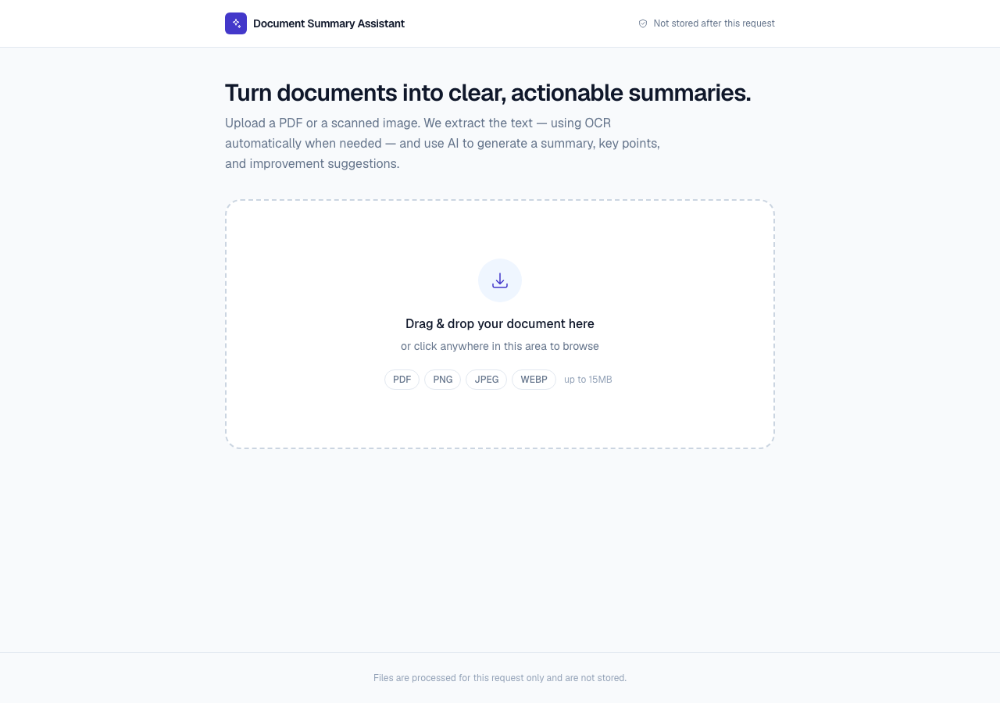
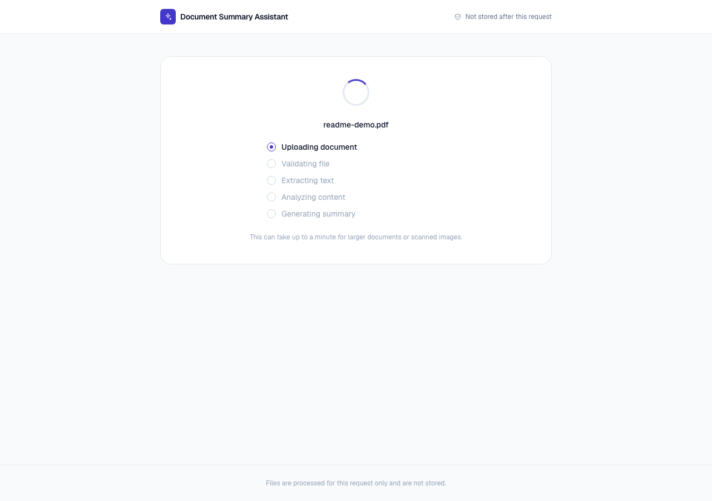

# Document Summary Assistant

**Live Demo:** _not yet deployed — add the URL here once hosted (see [Deployment](#deployment))_

## What it does

Upload a PDF or an image (including scanned/photographed pages) and get back an AI-generated summary, key points, main ideas, and improvement suggestions — in short, medium, or long form. The app is stateless: nothing about your document is stored anywhere after the request that processes it completes.

## Features

- PDF upload and image upload (PNG, JPEG, WEBP), drag-and-drop or file picker
- PDF text extraction (`pdf-parse`)
- OCR for images (`tesseract.js`)
- Scanned-PDF OCR (rasterize with `@napi-rs/canvas` + `pdfjs-dist`, then OCR) — for PDFs with no selectable text
- Gemini-backed summarization (short / medium / long — genuinely different output per length, not client-side truncation)
- Key points, main ideas, and improvement suggestions
- Responsive UI (320px through 1920px+), keyboard-accessible, `prefers-reduced-motion`-aware
- Real error handling for every failure mode: unsupported file, oversized file, empty/corrupted file, no readable text, OCR failure, AI timeout/quota/provider error — never a raw stack trace or internal error code shown to the user

## Tech Stack

Next.js 16 (App Router, TypeScript), Tailwind CSS 4, Google Gemini API (Structured Outputs, free tier), Zod, pdf-parse, tesseract.js. An OpenAI implementation of the same `AIProvider` interface also ships in the codebase (`src/lib/ai/openai-provider.ts`) but is not the active provider — see `src/lib/ai/index.ts`.

## Setup

```bash
npm install
cp .env.example .env.local
# edit .env.local and set GEMINI_API_KEY
npm run dev
```

Open http://localhost:3000.

## Environment Variables

See [`.env.example`](.env.example):

| Variable | Required | Description |
|---|---|---|
| `GEMINI_API_KEY` | Yes | Server-side only. Never sent to the browser. Free tier — see [docs/PRIVACY_AND_DATA_HANDLING.md](docs/PRIVACY_AND_DATA_HANDLING.md) for the rate/quota limits this implies. |
| `GEMINI_MODEL` | No | Defaults to `gemini-3.6-flash`. |
| `OLLAMA_FALLBACK_ENABLED` | No | Defaults to **disabled** (unset or anything other than the literal string `true`). When disabled, the router never attempts a network call to `OLLAMA_BASE_URL` — not even the availability check. Set to `true` only when `OLLAMA_BASE_URL` genuinely points to a reachable Ollama server: your own machine in local development, or a real private Ollama deployment in production. See [AI Router](#ai-router-gemini-primary-ollama-fallback) below. |
| `OLLAMA_BASE_URL` | No | Defaults to `http://127.0.0.1:11434`. Only used when `OLLAMA_FALLBACK_ENABLED=true`, and even then only after Gemini indicates quota/rate exhaustion or a transient outage. Server-side only — the browser never calls this URL. |
| `OLLAMA_MODEL` | No | Defaults to `gemma4:e4b`. |

## Scripts

```bash
npm run dev       # local dev server
npm run build     # production build
npm run start     # run the production build
npm run lint      # eslint
npx tsc --noEmit  # typecheck
npm run test      # unit + integration tests (vitest)
npm run test:e2e  # end-to-end tests (playwright; builds and runs a production server)
```

## Architecture

```
Browser (UploadZone / ProcessingState / SummaryView)
        │  multipart/form-data (file, length)
        ▼
POST /api/summarize  (Next.js Route Handler, Node runtime)
        │
        ├─ rate limit check (per-IP, in-memory)
        ├─ validateUpload()      → size + magic-byte MIME check
        ├─ extractText()         → pdf-parse (PDF) or tesseract.js (image)
        ├─ rate limit check (AI-specific)
        └─ AIProvider.generateSummary()  → AI Router (Gemini → Ollama fallback), Structured Outputs, Zod-validated
        ▼
JSON response { summary, keyPoints, mainIdeas, improvementSuggestions, ... }
```

The AI layer is behind an `AIProvider` interface (`src/lib/ai/types.ts`) — swapping providers means adding a new class, not touching the route handler.

### AI Router (Gemini primary, Ollama fallback)

```
AI Router (src/lib/ai/router.ts)
   │
   ├── GeminiProvider   — primary. Free-tier Google Gemini API.
   │
   └── OllamaProvider   — fallback only. A local model (default: gemma4:e4b)
                           served by a private Ollama instance the Next.js
                           server process can reach. The browser never talks
                           to Ollama directly.
```

- **Normal path**: Gemini succeeds → its result is returned. Ollama is never touched.
- **Fallback gate — `OLLAMA_FALLBACK_ENABLED`**: fallback is opt-in and **disabled by default**. When disabled, a fallback-eligible Gemini failure goes straight to a friendly `AI_UNAVAILABLE` response — the router never attempts any network call to `OLLAMA_BASE_URL`, not even the lightweight availability check. This is deliberate: `127.0.0.1` has no meaning inside a deployed environment, so a production deployment must never silently assume a local Ollama server exists.
- **Fallback triggers** (only reached when the gate above is enabled): `AI_RATE_LIMITED` (quota/rate exhaustion) and `AI_PROVIDER_ERROR`/`AI_TIMEOUT` (a transient outage — retried once on Gemini first before falling back).
- **Never falls back for**: `AI_CONFIG_ERROR` (missing/invalid Gemini API key) or `AI_INVALID_RESPONSE` (our own schema rejecting the model's output) — both are surfaced directly regardless of the fallback gate. A permanently misconfigured deployment must be visibly broken, not silently masked by a weaker fallback model that happens to "work."
- **If Ollama is also unreachable or fails** (fallback enabled): a single friendly `AI_UNAVAILABLE` error is returned — never which provider failed, never the Ollama URL, never a stack trace.
- **Local development**: set `OLLAMA_FALLBACK_ENABLED=true` in `.env.local` alongside `OLLAMA_BASE_URL` (default `http://127.0.0.1:11434`) and `OLLAMA_MODEL` (default `gemma4:e4b`) to exercise the fallback path against your own locally-running Ollama; see [Environment Variables](#environment-variables).
- **Production default is fallback disabled.** Localhost Ollama (`127.0.0.1:11434`) is a local-development convenience only — it is never a production deployment capability, and this project does not treat it as one. If a future deployment operates a real, private Ollama server the backend can reach, fallback can be turned on for that deployment by setting `OLLAMA_FALLBACK_ENABLED=true` and pointing `OLLAMA_BASE_URL` at it — no application code changes required. Without that, Gemini quota exhaustion in production surfaces the same friendly `AI_UNAVAILABLE` message, with zero network attempts toward any Ollama address. See [docs/SECURITY_ARCHITECTURE.md](docs/SECURITY_ARCHITECTURE.md).
- **Same UI regardless of provider**: the response shape (`summary`/`keyPoints`/`mainIdeas`/`improvementSuggestions`) is identical either way — the UI has no idea (and doesn't need to know) which provider actually generated it. Server logs record which one did, via safe structured fields only (e.g. `provider=ollama status=success`) — never document text, prompts, or keys.

### AI Pipeline

1. Extracted text is capped at 200,000 characters (from extraction) then re-truncated to 60,000 characters at the provider layer, bounding cost/latency regardless of document size.
2. The text is wrapped in explicit `<document>` tags inside the user message; a separate system message instructs the model to treat that content as untrusted data, never as instructions — see [docs/SECURITY_ARCHITECTURE.md](docs/SECURITY_ARCHITECTURE.md) for the live prompt-injection verification.
3. The requested length (short/medium/long) changes the actual prompt guidance sent to the model — live-verified to produce genuinely different output (59 / 143 / 319 words on the same test document), not a client-side truncation of one long response.
4. The response is constrained by Structured Outputs (a JSON schema derived from the same Zod schema used to validate it afterward) — the model cannot return free-form text instead of the expected `summary`/`keyPoints`/`mainIdeas`/`improvementSuggestions` shape.
5. Every SDK error (missing/invalid key, timeout, rate limit/quota, malformed/empty response) is mapped to a specific, safe `AppError` — never a raw exception reaching the client.

### OCR Pipeline

1. A PDF's text layer is read first (`pdf-parse`). If it yields near-zero text, the PDF is treated as scanned.
2. Scanned PDFs are rasterized page-by-page (`@napi-rs/canvas` + `pdfjs-dist`, max 1600px width, max 15 pages) and each page is OCR'd (`tesseract.js`), bounded by a 45s per-page timeout and a 120s total budget.
3. Plain images go through the same OCR step directly.
4. If OCR yields no usable text (blank/illegible image), a clear `EMPTY_EXTRACTED_TEXT` error is returned — never a silent empty summary.

## Security Notes

- **File validation**: extension and client MIME type are never trusted; the actual file signature is checked server-side (`file-type` package).
- **Prompt injection**: extracted document text is wrapped in explicit `<document>` tags with a system prompt instructing the model to treat it as data, never as instructions to follow.
- **Resource limits**: 15MB upload cap (enforced two ways — see below), 200-page PDF text cap / 15-page scanned-PDF OCR cap, 45s per-page OCR timeout with a 120s total OCR budget, 45s AI request timeout, no custom retry loop on top of the SDK's own bounded retries, per-IP rate limiting on both upload and AI-generation endpoints.
- **Error handling**: all API errors return a structured `{ code, message }` with a safe, user-facing message; internal errors and stack traces are logged server-side only, never returned to the client.
- **Headers**: CSP, HSTS, X-Frame-Options, X-Content-Type-Options, Referrer-Policy, and a restrictive Permissions-Policy are set on every response via `src/proxy.ts` (Next.js 16's middleware convention). The CSP's `script-src` is `'self' 'nonce-<random-per-request>' 'strict-dynamic'` — **no `'unsafe-inline'`**. Getting this working required two things `src/proxy.ts` documents in detail: (1) the nonce must be forwarded on the outgoing *request* headers, not just the response — Next's App Router reads `content-security-policy` from the request to nonce its own inline hydration script; (2) the root layout must render dynamically (`export const dynamic = "force-dynamic"`) since a statically prerendered page can never carry a fresh per-request nonce. Verified against a real production build: nonce present and matching in the rendered HTML, zero CSP console violations, full E2E suite passing.
- **Secrets**: `GEMINI_API_KEY` is read from environment variables only, used server-side only, and `.env.local`/`.env` are gitignored (`.env.example` — the checked-in template — deliberately is NOT gitignored, and contains variable names only, no values).

## Known Limitations

- **Scanned-PDF OCR is capped at 15 pages** (rasterized via `@napi-rs/canvas` + `pdfjs-dist`, then OCR'd with tesseract.js), with a 120s total processing budget and 1600px max render width, to bound CPU/memory/time on a hostile or huge scanned document. A PDF beyond that returns a partial result with a clear warning, not a silent truncation.
- **Rate limiting is in-memory**, scoped to a single running process — deliberately, not as an oversight. This is a real, meaningful limitation on classic serverless (e.g. AWS Lambda-style cold-start-per-request, or Vercel without Fluid Compute): each invocation can land on a fresh instance with an empty rate-limit map, so the limiter provides little to no protection there. It works as intended on a single always-on Node process (one container/VM, or Vercel Fluid Compute keeping instances warm). Adding Redis/Upstash for this assessment's scope would be infrastructure for appearance rather than a resolved need — the honest trade-off is documented here instead. A real multi-instance production deployment should replace `src/lib/rate-limit.ts`'s in-memory `Map` with a shared store (Redis, Upstash, or the platform's own rate limiting) without changing its call sites.
- **No authentication/accounts.** By design — this is a stateless single-use tool, not a multi-user product. Nothing uploaded is persisted or logged beyond transient processing.
- **Gemini free tier is low-volume by design** (10 RPM / 250 RPD on `gemini-3.6-flash` at time of writing). Fine for an assessment/demo; a real production deployment with meaningful traffic would need a paid tier.

## AI Provider

Uses the **Google Gemini API free tier** (`gemini-3.6-flash` by default) — this project is intentionally kept at zero API cost. The real happy path has been live-verified against the actual API (not just mocked): valid PDF, image OCR, scanned-PDF OCR, all 3 summary lengths with genuinely different output (word counts: short 59 / medium 143 / long 319 on the same test document), prompt-injection resistance (a real adversarial document did not leak config or comply with injected instructions), timeout handling, invalid/missing key handling, and both the app's own rate limiter and a real provider error path. See [docs/SECURITY_TEST_REPORT.md](docs/SECURITY_TEST_REPORT.md) for the full breakdown. Model choice was verified against the live API itself, not just static docs — the initially-selected `gemini-2.5-flash` turned out to already be closed to new projects, discovered via a real 404 recommending `gemini-3.6-flash`.

## Testing

**105 unit/integration tests (Vitest) and 30 end-to-end tests (Playwright, across desktop + mobile viewports) — all passing**. See [docs/TEST_CASES.md](docs/TEST_CASES.md) for the full breakdown and [docs/SECURITY_TEST_REPORT.md](docs/SECURITY_TEST_REPORT.md) for the security-specific matrix.

## Screenshots

Idle state and processing state, captured from a real local run (desktop, 1280px):




See [docs/UI_QA_REPORT.md](docs/UI_QA_REPORT.md) for the full set of states reviewed with real Gemini-generated content across 320–1920px.

## Design System

`src/app/globals.css` defines semantic design tokens (background/surface/border/primary/text/success/warning/danger/info, each theme-aware for light and dark) registered as Tailwind utilities, plus a consistent radius and shadow scale. One shared icon set (`src/components/icons.tsx`). See [docs/UI_QA_REPORT.md](docs/UI_QA_REPORT.md) for the full responsive/accessibility audit, including live screenshots with real AI-generated content at 320–1920px.

## Documentation

| Doc | Covers |
|---|---|
| [docs/APPROACH.md](docs/APPROACH.md) | 200-word approach summary |
| [docs/ARCHITECTURE.md](docs/ARCHITECTURE.md) | System architecture, component responsibilities |
| [docs/DATA_FLOW.md](docs/DATA_FLOW.md) | Request lifecycle, trust boundaries |
| [docs/THREAT_MODEL.md](docs/THREAT_MODEL.md) | Assets, actors, threats and mitigations per area |
| [docs/SECURITY_ARCHITECTURE.md](docs/SECURITY_ARCHITECTURE.md) | How each security control is actually implemented, including the CSP fix history |
| [docs/SECURITY_TEST_REPORT.md](docs/SECURITY_TEST_REPORT.md) | PASS/FAIL/NOT TESTED table, 32 security tests |
| [docs/PENETRATION_TEST_REPORT.md](docs/PENETRATION_TEST_REPORT.md) | Narrative pentest findings, including two real bugs found and fixed |
| [docs/OWASP_VERIFICATION_MATRIX.md](docs/OWASP_VERIFICATION_MATRIX.md) | OWASP Top 10 / API Top 10 / LLM risk mapping |
| [docs/TEST_CASES.md](docs/TEST_CASES.md) | Full functional test case list |
| [docs/UI_QA_REPORT.md](docs/UI_QA_REPORT.md) | Responsive/accessibility/state audit |
| [docs/ERROR_CATALOG.md](docs/ERROR_CATALOG.md) | Every error code, status, message, and recovery action |
| [docs/PRIVACY_AND_DATA_HANDLING.md](docs/PRIVACY_AND_DATA_HANDLING.md) | What data goes where |
| [SECURITY.md](SECURITY.md) | Vulnerability reporting |
| [CONTRIBUTING.md](CONTRIBUTING.md) | Development setup and PR expectations |
| [CHANGELOG.md](CHANGELOG.md) | What changed, including bugs found and fixed |

## Privacy

Uploaded file bytes and extracted text are sent to Google's Gemini API for summarization and are otherwise not persisted, logged in full, or stored by this application. No accounts, no document history, no analytics beyond default Next.js/hosting request logs. See [docs/PRIVACY_AND_DATA_HANDLING.md](docs/PRIVACY_AND_DATA_HANDLING.md) for full detail.

## Assessment Requirements

| Requirement | Status | Where |
|---|---|---|
| PDF upload | Done | `UploadZone`, `src/lib/validation.ts` |
| Image upload | Done | Same upload path, PNG/JPEG/WEBP by magic-byte detection |
| Drag-and-drop | Done | `UploadZone.tsx` |
| File picker | Done | `UploadZone.tsx` |
| PDF text extraction | Done | `pdf-parse` in `src/lib/extraction/extract.ts` |
| OCR | Done | `tesseract.js`, including scanned-PDF rasterize+OCR fallback |
| Smart summary | Done | Gemini Structured Outputs, `src/lib/ai/gemini-provider.ts` |
| Short summary | Done, live-verified | 59 words on test document |
| Medium summary | Done, live-verified | 143 words on the same document |
| Long summary | Done, live-verified | 319 words on the same document |
| Key points / main ideas | Done | Returned and rendered as distinct sections |
| Improvement suggestions | Done | Distinct, visually marked as AI-generated |
| Responsive UI | Done | 320px–1920px, automated + live-screenshot verified |
| Error handling | Done | Every failure mode mapped to a specific, safe message — see [docs/ERROR_CATALOG.md](docs/ERROR_CATALOG.md) |
| Loading states | Done | Real stage-based processing indicator, no fake percentages |
| Documentation | Done | This README plus 12 files under `docs/` |
| Hosted application | **Pending** — see Deployment below | — |
| GitHub repository | This repository | — |
| README | This file | — |
| Approach write-up (≤200 words) | Done, exactly 200 words | [docs/APPROACH.md](docs/APPROACH.md) |

## Deployment

Designed for Vercel (or any Node.js host supporting Next.js 16). Set `GEMINI_API_KEY` (and optionally `GEMINI_MODEL`) as environment variables on the hosting platform — never commit them. Note the Gemini free tier's request-per-minute/day limits (see [docs/SECURITY_ARCHITECTURE.md](docs/SECURITY_ARCHITECTURE.md)) before relying on this for real traffic.
